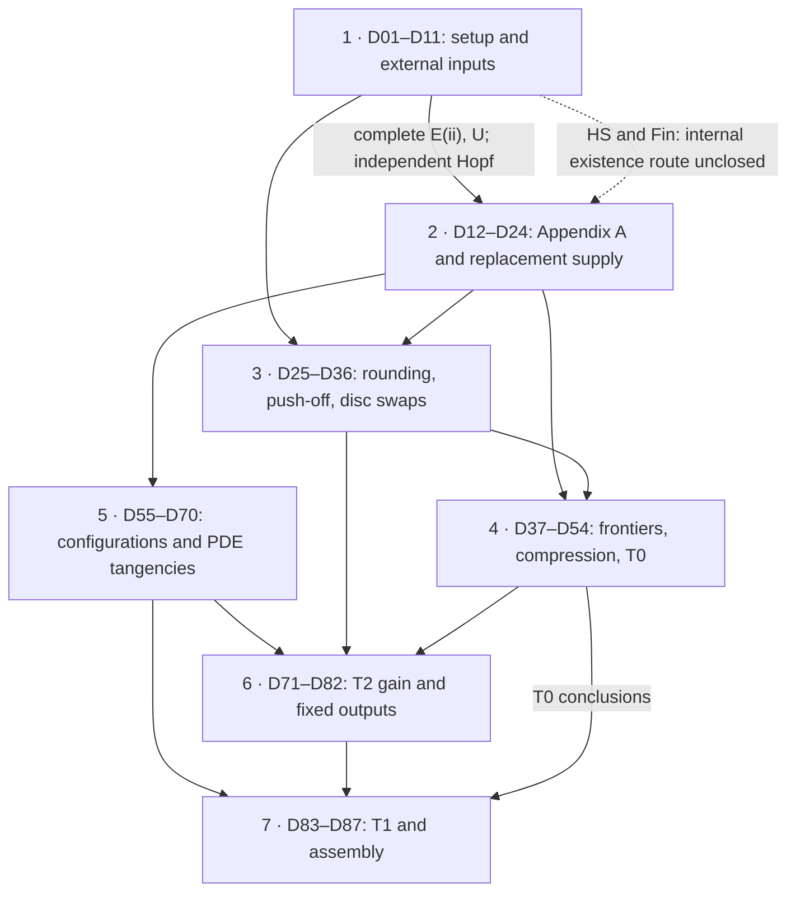
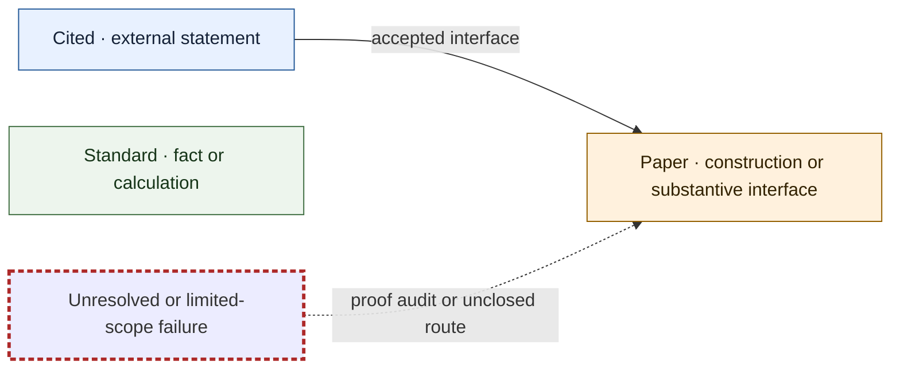
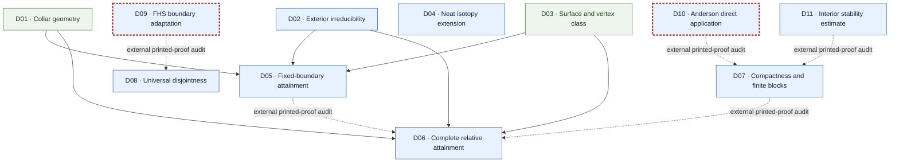
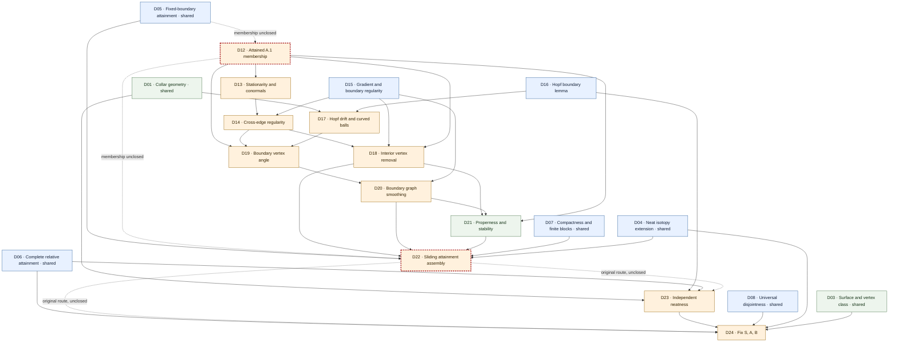
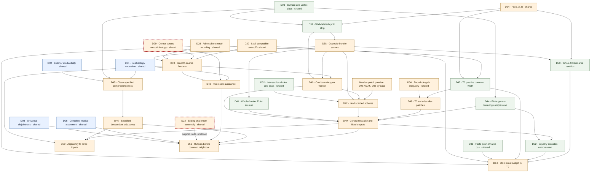
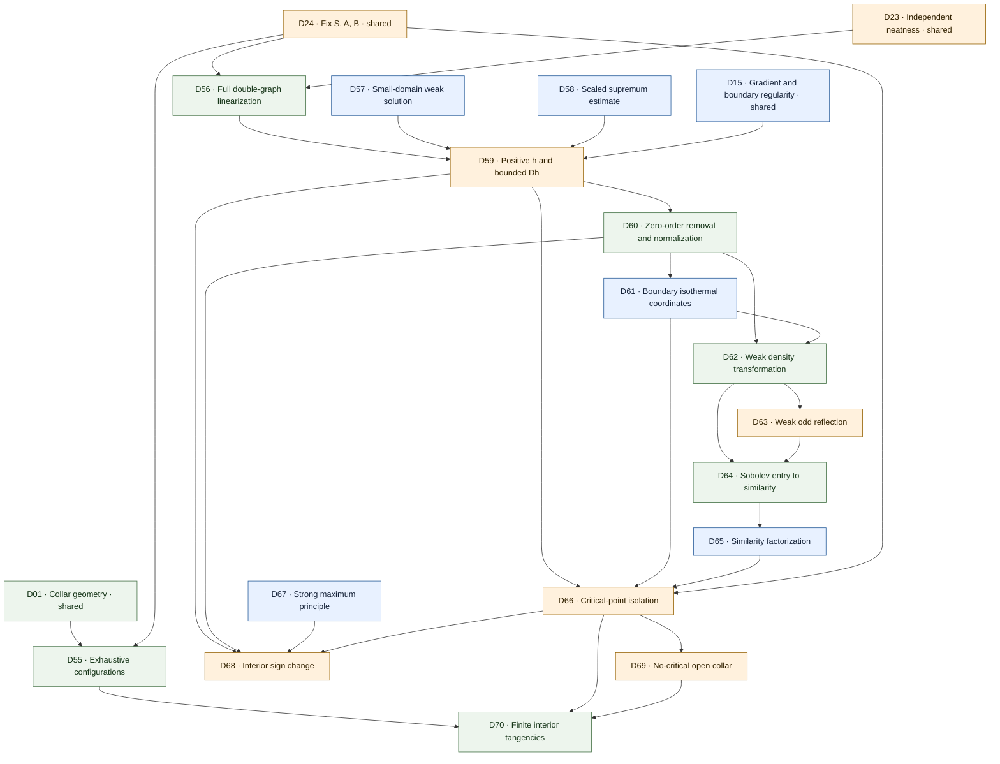

# Dependency map

Version 1.0 · 4 October 2026. [Step table](step-verification.md) · [Repairs](repairs.md) · [Open items](open-items.md)

First comes the seven-block overview, then a type legend and a subgraph for each block. Arrows run **from input to dependent step**. Solid arrows describe repaired local dependencies or applicability inputs to accepted complete external statements. Dashed arrows mark a printed-proof audit or an original unclosed existence route; they do not certify those branches. Block arrows aggregate dependencies, rather than asserting that every step in one block depends on every step in the other.

## Seven-block overview

## Type and edge legend

Types are **16 Cited, 51 Paper, 20 Standard**, independent of verdict. Red dashed borders add warnings without changing a step's type. Verdicts are in the step table. Shared input nodes repeated in another block do not count as new steps. Conditional Appendix regularity arrows mean **given an A.1 minimizer**, not a completed existence proof.

## 1. Setup and external inputs (D01–D11)

D05/D07 → D06 and D09 → D08 expand the printed proofs behind the complete E/U statements; D10/D11 → D07 audits Fin. The dashed branches remain incomplete at proof level. In the body, D06–D08 are used as accepted complete statement interfaces.

## 2. Appendix A and replacement supply (D12–D24)

The accepted body path is D06 → independent D23 Hopf → D24. D12/D22 leave the internal existence route unclosed. D13–D21 regularity is conditional and cannot manufacture an A.1 minimizer. The D22 alternatives are shown only as the original route.

## 3. Rounding, push-off and disc swaps (D25–D36)

```mermaid
flowchart TD
  D02["D02 · Exterior irreducibility · shared"]:::cited
  D03["D03 · Surface and vertex class · shared"]:::standard
  D04["D04 · Neat isotopy extension · shared"]:::cited
  D06["D06 · Complete relative attainment · shared"]:::cited
  D22["D22 · Sliding attainment assembly · shared"]:::paper
  D23["D23 · Independent neatness · shared"]:::paper
  D25["D25 · Rounding profile and gain"]:::standard
  D26["D26 · Whole-circle safe coordinates"]:::paper
  D27["D27 · True area-density error"]:::standard
  D28["D28 · Admissible smooth rounding"]:::paper
  D29["D29 · Corner versus smooth isotopy"]:::paper
  D30["D30 · Leaf-compatible push-off"]:::paper
  D31["D31 · Finite push-off area cost"]:::standard
  D32["D32 · Intersection circles and discs"]:::standard
  D33["D33 · Separate innermost families"]:::paper
  D34["D34 · Empty-side ball placement"]:::paper
  D35["D35 · Smooth swap competitors"]:::paper
  D36["D36 · Two-circle gain inequality"]:::paper
  D03 --> D26
  D25 --> D27
  D26 --> D27
  D25 --> D28
  D26 --> D28
  D27 --> D28
  D28 --> D29
  D04 --> D29
  D23 --> D30
  D28 --> D30
  D29 --> D30
  D30 --> D31
  D03 --> D32
  D32 --> D33
  D32 --> D34
  D33 --> D34
  D02 --> D34
  D28 --> D34
  D29 --> D34
  D34 --> D35
  D28 --> D35
  D29 --> D35
  D06 --> D35
  D22 -.->|"original route, unclosed"| D35
  D33 --> D36
  D35 --> D36
  class D22 audit
  class D29 audit
  classDef cited fill:#e8f1ff,stroke:#265b99,color:#152238
  classDef paper fill:#fff1dd,stroke:#946000,color:#322200
  classDef standard fill:#edf5ed,stroke:#427044,color:#163518
  classDef audit stroke:#ad2929,stroke-width:3px,stroke-dasharray:5 3
```

D29 uses tame corner transport and positive-width smooth endpoint comparison. D35 additionally needs the slightly larger smooth three-ball of R05. R03 supplies the same four-sector widths and common gain to frontiers and disc swaps.

## 4. Frontiers, compression and T0 (D37–D54)

D42 has the separate no-disc-patch premise established by D48, D79 or D85 in its configuration. D43/D51 use two scales; D45/D46 preserve specified descendants. D54 uses D52’s genus-equality/no-compression branch.

## 5. Configurations and elliptic tangencies (D55–D70)

D63 is used only for the boundary case; D64 supplies the Sobolev entry before D65. D66 isolates tangencies, not the whole intersection. D69 gives a no-critical open collar, not a positive gradient bound up to the boundary.

## 6. T2 uniform gain and fixed outputs (D71–D82)

```mermaid
flowchart TD
  D04["D04 · Neat isotopy extension · shared"]:::cited
  D06["D06 · Complete relative attainment · shared"]:::cited
  D08["D08 · Universal disjointness · shared"]:::cited
  D22["D22 · Sliding attainment assembly · shared"]:::paper
  D24["D24 · Fix S, A, B · shared"]:::paper
  D26["D26 · Whole-circle safe coordinates · shared"]:::paper
  D28["D28 · Admissible smooth rounding · shared"]:::paper
  D29["D29 · Corner versus smooth isotopy · shared"]:::paper
  D31["D31 · Finite push-off area cost · shared"]:::standard
  D36["D36 · Two-circle gain inequality · shared"]:::paper
  D39["D39 · Smooth coarse frontiers · shared"]:::paper
  D40["D40 · One boundary per frontier · shared"]:::paper
  D41["D41 · Whole-frontier Euler account · shared"]:::standard
  D42["D42 · No discarded spheres · shared"]:::paper
  D43["D43 · Two-scale avoidance · shared"]:::paper
  D44["D44 · Finite genus-lowering compression · shared"]:::standard
  D46["D46 · Specified descendant adjacency · shared"]:::paper
  D52["D52 · Equality excludes compression · shared"]:::standard
  D53["D53 · Whole-frontier area partition · shared"]:::standard
  D56["D56 · Full double-graph linearization · shared"]:::standard
  D66["D66 · Critical-point isolation · shared"]:::paper
  D68["D68 · Interior sign change · shared"]:::paper
  D69["D69 · No-critical open collar · shared"]:::paper
  D70["D70 · Finite interior tangencies · shared"]:::standard
  D71["D71 · Fixed sign arc and r1"]:::paper
  D72["D72 · Actual smooth perturbation"]:::paper
  D73["D73 · Noncollapsing circles"]:::paper
  D74["D74 · Collapsed-ball quotient length"]:::standard
  D75["D75 · Uniform good-region length"]:::paper
  D76["D76 · Buffered angle lower bound"]:::paper
  D77["D77 · Whole-intersection safe tube"]:::paper
  D78["D78 · Exact smooth width platform"]:::paper
  D79["D79 · Gain fixed before t"]:::paper
  D80["D80 · Positive-parameter output classes"]:::paper
  D81["D81 · Fixed descendants for later z"]:::paper
  D82["D82 · T2 four-clause completion"]:::paper
  D69 --> D71
  D56 --> D72
  D66 --> D72
  D69 --> D72
  D70 --> D72
  D71 --> D72
  D24 --> D72
  D72 --> D73
  D66 --> D73
  D68 --> D73
  D69 --> D73
  D73 --> D74
  D70 --> D74
  D71 --> D75
  D72 --> D75
  D74 --> D75
  D66 --> D76
  D69 --> D76
  D72 --> D76
  D74 --> D76
  D26 --> D77
  D72 --> D77
  D76 --> D77
  D28 --> D78
  D77 --> D78
  D75 --> D78
  D36 --> D79
  D75 --> D79
  D76 --> D79
  D77 --> D79
  D78 --> D79
  D72 --> D79
  D72 --> D80
  D04 --> D80
  D29 --> D80
  D39 --> D80
  D44 --> D80
  D80 --> D81
  D43 --> D81
  D46 --> D81
  D08 --> D81
  D06 --> D81
  D22 -.->|"original route, unclosed"| D81
  D79 --> D82
  D80 --> D82
  D39 --> D82
  D40 --> D82
  D41 --> D82
  D42 --> D82
  D44 --> D82
  D46 --> D82
  D52 -->|"bookkeeping argument reuse"| D82
  D53 -->|"bookkeeping argument reuse"| D82
  D31 --> D82
  class D22 audit
  class D29 audit
  classDef cited fill:#e8f1ff,stroke:#265b99,color:#152238
  classDef paper fill:#fff1dd,stroke:#946000,color:#322200
  classDef standard fill:#edf5ed,stroke:#427044,color:#163518
  classDef audit stroke:#ad2929,stroke-width:3px,stroke-dasharray:5 3
```

D75 needs only D74, the quotient-length part of B.4. D77 independently supplies local geometry; D28 enters D78’s rounding interface rather than proving D77’s uniform tube. R10 recomputes every cap and gain, fixing ε* before t; R11 completes D80’s smooth class comparison.

## 7. T1 and theorem assembly (D83–D87)

```mermaid
flowchart TD
  D24["D24 · Fix S, A, B · shared"]:::paper
  D28["D28 · Admissible smooth rounding · shared"]:::paper
  D31["D31 · Finite push-off area cost · shared"]:::standard
  D36["D36 · Two-circle gain inequality · shared"]:::paper
  D39["D39 · Smooth coarse frontiers · shared"]:::paper
  D40["D40 · One boundary per frontier · shared"]:::paper
  D41["D41 · Whole-frontier Euler account · shared"]:::standard
  D42["D42 · No discarded spheres · shared"]:::paper
  D43["D43 · Two-scale avoidance · shared"]:::paper
  D44["D44 · Finite genus-lowering compression · shared"]:::standard
  D45["D45 · Clean specified compressing discs · shared"]:::paper
  D46["D46 · Specified descendant adjacency · shared"]:::paper
  D49["D49 · Genus inequality and fixed outputs · shared"]:::paper
  D50["D50 · Adjacency to three inputs · shared"]:::paper
  D51["D51 · Outputs before common neighbour · shared"]:::paper
  D52["D52 · Equality excludes compression · shared"]:::standard
  D53["D53 · Whole-frontier area partition · shared"]:::standard
  D54["D54 · Strict area budget in T0 · shared"]:::paper
  D55["D55 · Exhaustive configurations · shared"]:::standard
  D56["D56 · Full double-graph linearization · shared"]:::standard
  D66["D66 · Critical-point isolation · shared"]:::paper
  D68["D68 · Interior sign change · shared"]:::paper
  D70["D70 · Finite interior tangencies · shared"]:::standard
  D73["D73 · Noncollapsing circles · shared"]:::paper
  D74["D74 · Collapsed-ball quotient length · shared"]:::standard
  D76["D76 · Buffered angle lower bound · shared"]:::paper
  D77["D77 · Whole-intersection safe tube · shared"]:::paper
  D78["D78 · Exact smooth width platform · shared"]:::paper
  D80["D80 · Positive-parameter output classes · shared"]:::paper
  D81["D81 · Fixed descendants for later z · shared"]:::paper
  D82["D82 · T2 four-clause completion · shared"]:::paper
  D83["D83 · T1 interior perturbation"]:::paper
  D84["D84 · T1 good-region interfaces"]:::paper
  D85["D85 · T1 gain and no patches"]:::paper
  D86["D86 · T1 four-clause completion"]:::paper
  D87["D87 · Conditional theorem assembly"]:::paper
  D55 --> D83
  D56 --> D83
  D66 --> D83
  D68 --> D83
  D70 --> D83
  D24 --> D83
  D83 --> D84
  D73 -->|"interior-only argument reuse"| D84
  D74 -->|"interior-only argument reuse"| D84
  D76 -->|"interior-only argument reuse"| D84
  D77 -->|"interior-only argument reuse"| D84
  D84 --> D85
  D28 --> D85
  D36 --> D85
  D78 -->|"ball-only platform reuse"| D85
  D83 --> D85
  D85 --> D86
  D80 --> D86
  D81 --> D86
  D39 --> D86
  D40 --> D86
  D41 --> D86
  D42 --> D86
  D43 --> D86
  D44 --> D86
  D45 --> D86
  D46 --> D86
  D52 -->|"bookkeeping argument reuse"| D86
  D53 -->|"bookkeeping argument reuse"| D86
  D31 --> D86
  D24 --> D87
  D49 --> D87
  D50 --> D87
  D51 --> D87
  D54 --> D87
  D55 --> D87
  D81 --> D87
  D82 --> D87
  D86 --> D87
  classDef cited fill:#e8f1ff,stroke:#265b99,color:#152238
  classDef paper fill:#fff1dd,stroke:#946000,color:#322200
  classDef standard fill:#edf5ed,stroke:#427044,color:#163518
  classDef audit stroke:#ad2929,stroke-width:3px,stroke-dasharray:5 3
```

D84 uses the interior-only versions of diameter, quotient, angle and tube arguments. D85 uses newly unified gains/platforms. D86 retains genus equality before the area step. D87 is the conditional repaired conclusion, not independent certification of all cited printed proofs.

## Choice order and scope

Fixed minima → fixed perturbation scheme → diameter and ball scales → good-region length → buffered local geometry → common caps/platform → fixed ε* → small-parameter threshold → t → bad-region floor → rounding → finite push-off cost → push-off time. The coarse output classes and specified compression descendants are fixed before any later z; after z, the parameter and both geometric scales may change within those same classes.

The later-neighbour representatives need not retain the area branch's quantitative gain. No edge runs from the desired no-disc-patch conclusion back to the width or competitor construction. Appendix A membership/sequence debts and external printed-proof issues are retained in the open-items file.
